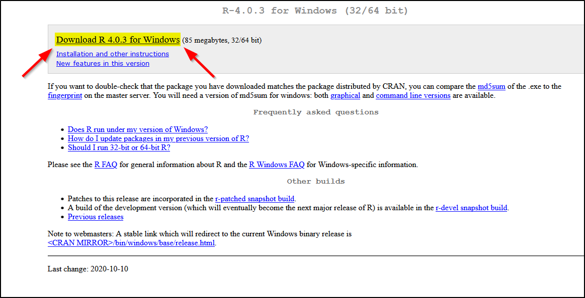
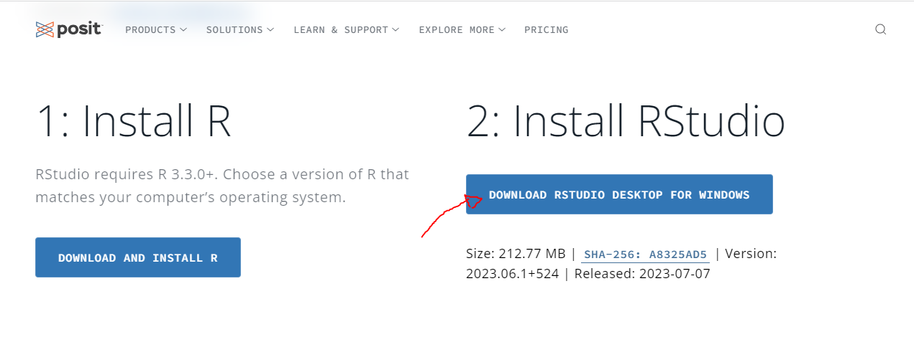
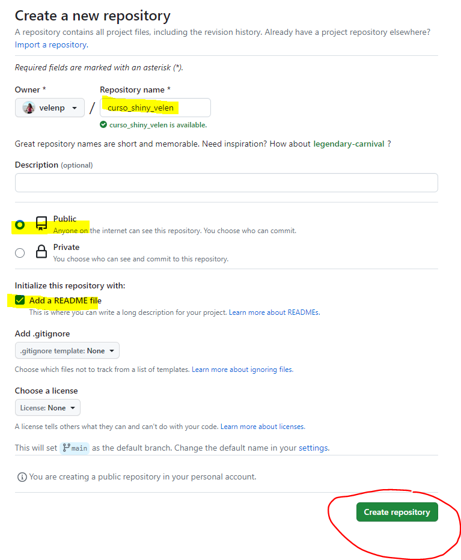
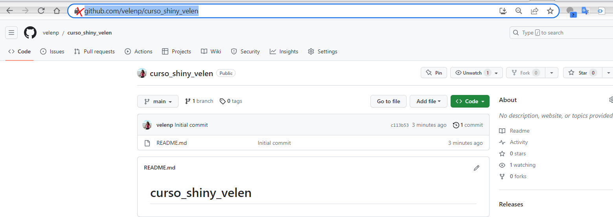
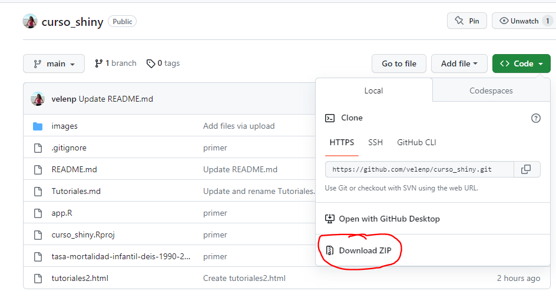
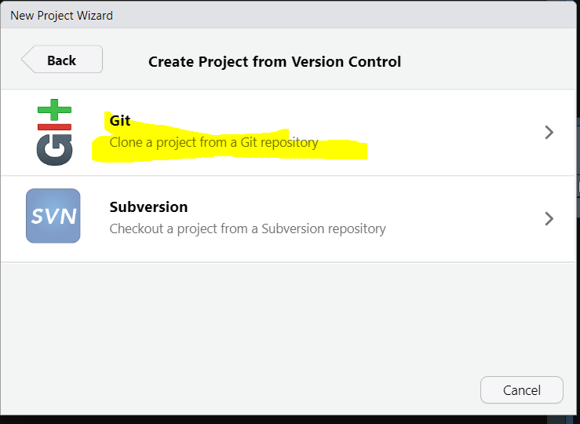
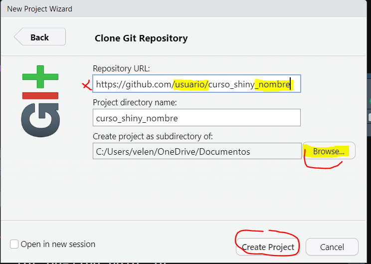
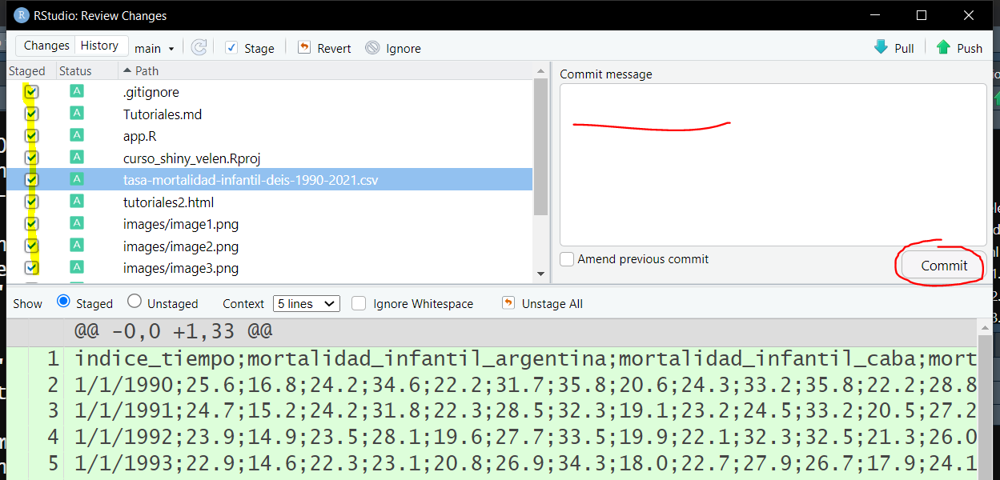

# Curso: Introducción al procesamiento, análisis y visualización interactiva de datos abiertos en salud -  UNTREF


## Instalar R y RStudio: {#instalar-r-y-rstudio}

Instalaciòn de R: Permite comprender el lenguaje de programación R

Instalación de RStudio: Se instala un entorno de desarrollo integrado (IDE) que facilita el uso de R. Es el IDE más usado para el lenguaje R. 

Para instalar R ingresa [aca](https://cloud.r-project.org/) y sigue las instrucciones:





Una vez instalado R, pueden instalar RStudio:

RStudio es un entorno integrado de desarrollo (IDE por sus siglas en inglés). Si bien, podemos utilizar R directamente desde documentos de texto plano, se recomienda instalar y usar un IDE, ya que es una manera más práctica para trabajar y desarrollar nuestros proyectos. Esto se debe a que nos facilitará tareas como administrar los archivos con los que trabajamos, emplear herramientas para escribir y revisar nuestro código, efectuar capacidades gráficas, así como fluidez para trabajar en el entorno local de nuestro ordenador.

Ingresar al sitio oficial de [RStudio](https://rstudio.com/products/rstudio/download/), descargar e instalar el programa. 





## Integrar GIT con R y Rstudio {#integrar-git-con-r-y-rstudio}

R en combinación con el sistema de control de versiones distribuidas Git ofrece una configuración conveniente para que un proyecto sea reproducible. Git le permite rastrear y compartir su código y análisis de manera eficiente.

Algunas razones para utilizar GIT y GitHub son:


* Facilita el compartir sus proyectos de forma sencilla una vez que estén configurados correctamente.
* Favorece la colaboración, permitiendo a otras personas contribuir a su proyecto y viceversa. Además, pueden reportar errores o sugerir nuevas incorporaciones al proyecto.
* Le permite volver a versiones anteriores en caso de encontrar errores o eliminar algo accidentalmente.
* Permite visualizar los cambios entre diferentes versiones de su código, análisis o texto escrito.

**GitHub **es un servicio web fácil de usar que le permite almacenar el repositorio de su proyecto de forma remota. Otras alternativas son GitLab y Bitbucket.

RStudio integra soporte para Git, por lo que utilizaremos la combinación ampliamente utilizada R + Git + RStudio para el control de versiones y desarrollo colaborativo de proyectos.


### 1. Instalar Git

Desde el siguiente enlace: [https://git-scm.com/downloads](https://git-scm.com/downloads)


### 2. Crear cuenta de GitHub

Crear su cuenta desde el siguiente enlace [https://github.com/ ](https://github.com/)


### 3. Configure Git en RStudio: 

Indique a RStudio dónde encontrar la instalación de Git. Para ello sigue los siguientes pasos:


1. Abra RStudio y vaya a Herramientas > Opciones globales… haga clic en Git/SVN
2. Marque Habilitar interfaz de control de versiones para proyectos de RStudio
3. Establezca la ruta al ejecutable de Git que acaba de instalar. Pruede ayudarse del boton “Browse..” para llegar a la ruta. En la imagen un ejemplo de ruta.
4. Reinicie RStudio. Si funcionó, encontrará el icono de Git en la barra de herramientas superior, como se muestra a continuación.

    


### 4. Configure Git: 

En la consola de RStudio escribir

```{r, eval=F, echo=T}
library(usethis)
edit_git_config()
```

Luego verán que se crea una ventana llamada “.gitconfig” y alli deberán completar los campos _name_ y _email_ tal como se ve en la figura y guardar. 


 

### 5. Crear un repositorio propio en GitHub

1. Ingresar a la página de GitHub y crear un repositorio nuevo que se llame “curso_shiny_sunombre” agregandole su nombre al final. Al hacer clic en “new” se abrirá una pantalla como la que está a continuación.

    





2. Ahora, ingrese al repositorio y copie el enlace, tal como se muestra en la captura.

        



### 6. Clonar un repositorio, o conectar un proyecto con un repositorio GitHub
1. Ir al repositorio que desea clonar. En este caso, el del curso es: 

[https://github.com/velenp/curso_shiny](https://github.com/velenp/curso_shiny)

> Por ahora tenemos vacío este repo. Iremos subiendo proyectos a medida que avancemos con el curso.


Haga clic en el botón verde que dice “code” y se desplegará una ventana, donde puede copiar el enlace del repositorio, o también puede descargar el .ZIP. En este caso vamos a descargar el .ZIP. Si usted desea conectarse para trabajar colaborativamente con ese repositorio puede copiar el enlace y clonarlo desde RStudio. Hay que tener en cuenta que para que esto sea posible el repositorio debe estar compartido con su usuario, de lo contrario no podrá trabajar colaborativamente. 


En este caso, lo que vamos a hacer es clonar el repositorio vacío que ustedes crearon y a ese repositorio del que ustedes son propietarios subirles los materiales que se descargaron desde aquí en un .ZIP.


        



2. En RStudio, en el margen superior derecho, ir a “nuevo proyecto” o “New Project”.
3. En la pantalla que se abre seleccione la opción “Versión Control” tal como se ve en la captura a continuación.

        


Seleccione la opción GIT


Ingrese la URL del repositorio que tiene su nombre, que crearon en el paso 5, seleccione la carpeta donde lo quiere alojar y ponga crear proyecto.

        


### 7. Agregar archivos a su repositorio y realizar un commit

1. En su computadora, ahora encontrará una carpeta llamada “curso_shiny_nombre” con el contenido del curso. En esta carpeta deberán pegar el contenido de la carpeta del archivo.ZIP. Importante: no reemplazar archivos y eliminar el archivo “curso_shiny.Rproj” de modo que quede un solo archivo con extensión .Rproj en la carpeta, y este tenga su nombre.

2. Si vuelve a RStudio, verán en la ventada GIT, que se encuentra como solapa en el mismo espacio que el Environment, todos estos archivos nuevos agregados. 

        


3. Estos archivos se encuentran guardados localmente. Si quieren subirlos a su repositorio de GitHub deberán hacer un “commit” y luego “Push”. Veamos el paso a paso:

4. Hacer clic en “Commit”, y verán que se despliega una ventana como la presentada a continuación. Allí, tildar todos los archivos tal como se ve en la captura. Donde dice “commit message” poner un mensaje que identifique a este commit, como por ejemplo “primer commit”. y por último hacer clic en “commit” que se muestra en la figura señalada en rojo.

        



5. Aparecerá una ventana negra con el detalle de la tarea realizada. Cerrar esa ventana y hacer clic en el botón de “push” con una flecha verde hacia arriba, tal como se muestra en la captura.

        


6. Ahora, si ingresan al repositorio desde la página de GitHub verán que contiene los archivos que subieron. Cada vez que modifique alguno de estos archivos o agreguen un archivo nuevo deberán repetir el proceso de “Commit” y luego “Push” para actualizar su repositorio de GitHub. El texto que pongan en “commit message” será una referencia al momento de revisar el historial de cambios que tuvo el repositorio.

7. En caso que estén trabajando con un repositorio de forma colaborativa, con otras personas, es necesario, que antes de realizar cada “commit” y “push” presionen el botón de la flecha celeste hacia abajo que dice “Pull”. De este modo podrán incorporar los cambios que realizó otro colaborador en su proyecto. Es importante realizar el “Pull” antes que el “Push” para evitar conflictos entre versiones.  Si varios colaboradores están trabajando en el mismo proyecto y realizan cambios en la misma parte del código, un "pull request" permite resolver posibles conflictos antes de que se mezclen los cambios. Esto evita que los cambios se fusionen con conflictos no resueltos, lo que podría llevar a errores en el código.


## Videos recomendados:

En este video se muestra como descargar un repositorio de GitHub en RStudio y posteriormente como subir las actualizaciones al GitHub descargado.

```{r echo=FALSE, message=FALSE, warning=FALSE}
library(vembedr)
embed_youtube("rwryI4c7NMY",width = NULL,
height = 400,
ratio = c("16by9"))
```

En este video se explica como:

1. Crear un repositorio
2. Clonar un repositorio
3. Configurar git
4. Comentar y subir cambios

```{r echo=FALSE, message=FALSE, warning=FALSE}

embed_youtube("JN6rzv4zSJ4",width = NULL,
height = 400,
ratio = c("16by9"))
```


