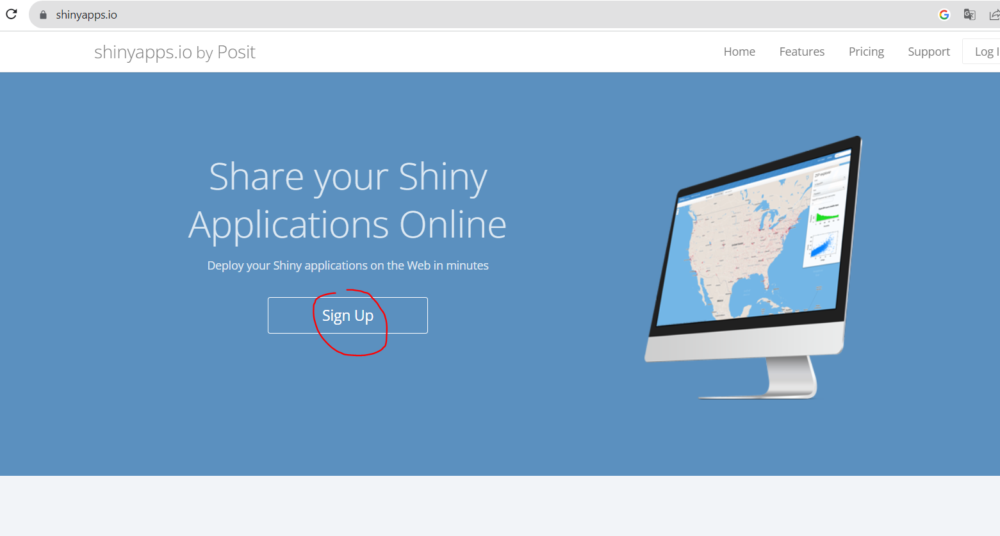
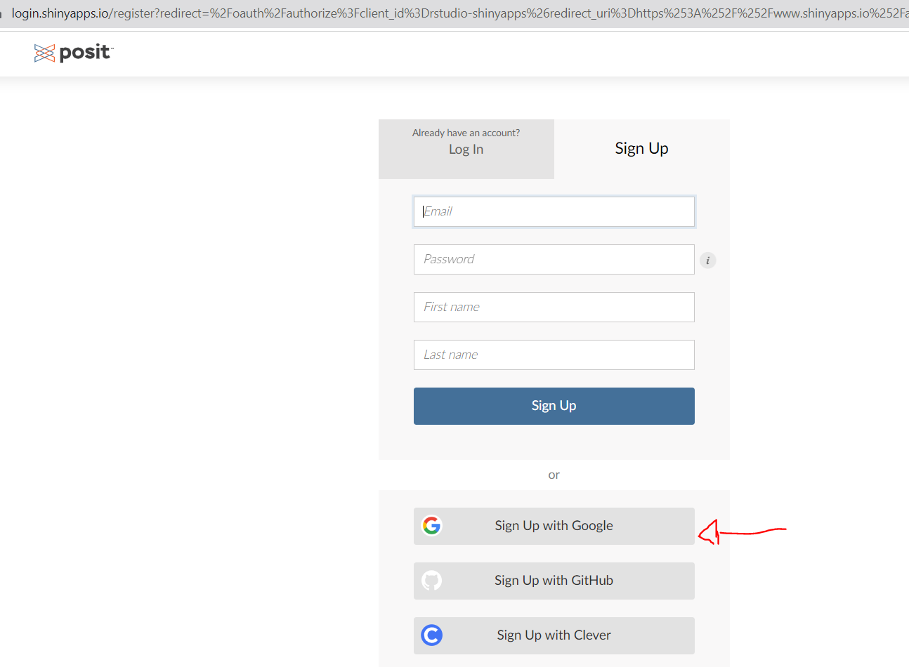
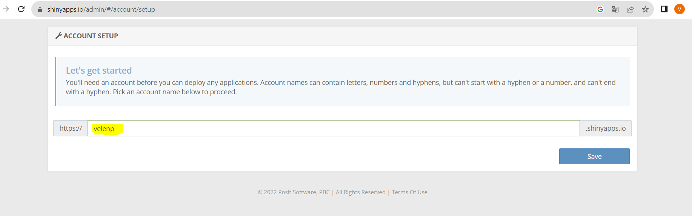
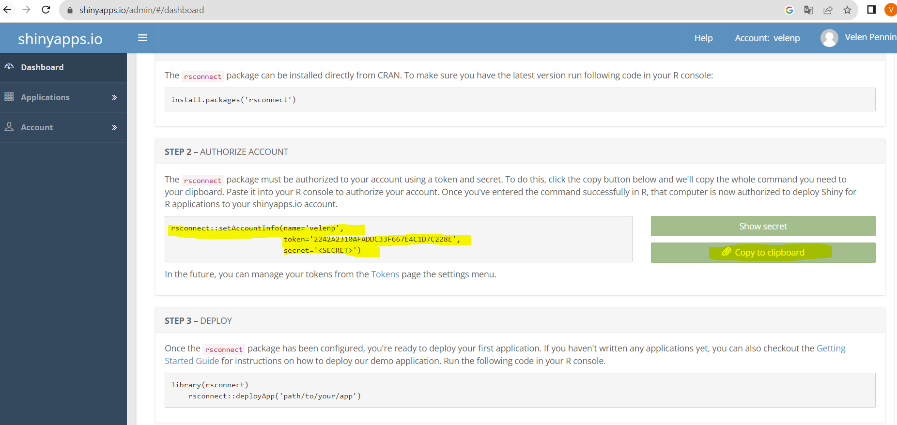
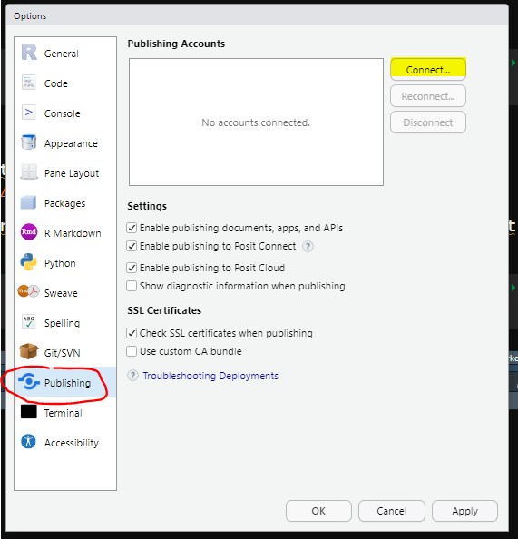
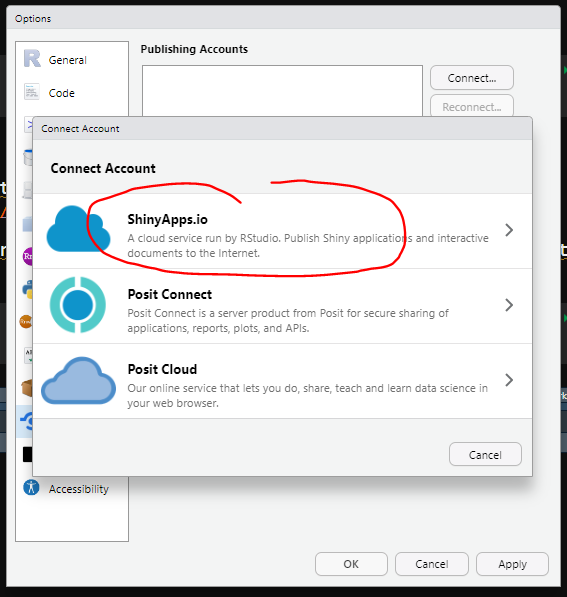
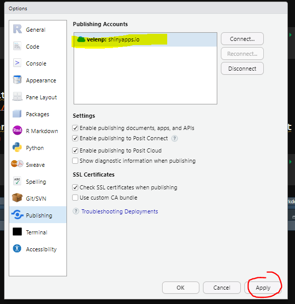
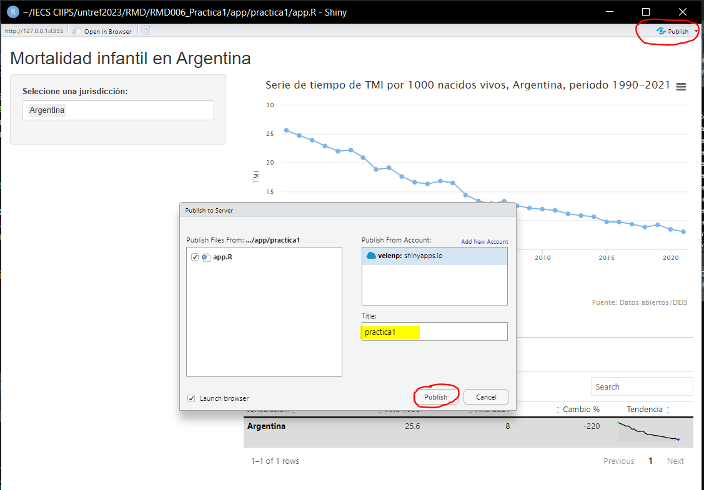

```{r setup, include=FALSE}
knitr::opts_chunk$set(
	echo = TRUE,
	message = FALSE,
	warning = FALSE
)

```

## 1. Cear cuenta en ShinyApps.io

En primer lugar, vamos a crearnos una cuenta en [ShinyApps.io](https://www.shinyapps.io/) tal como se señala en las capturas 1 y 2.






Para crear una cuenta debemos elegir un nombre de cuenta que no exista, como se señala en la captura 3. 




Una vez creada la cuenta y habiendo ingresado a la plataforma, se les muestra como instalar el paquete *rsconnect* si no lo tienen instalado.

    install.packages("rsconnect")
    
Es necesario dejar a mano el código para autorizar la cuenta que se señala en la captura 4. Pueden hacer clic en el botón verde para copiar al portapapeles. Otra forma de acceder a copiar este código es, desde el menú de la izquierda, ir a *Accounts*, luego a *Tokens*. y desde allí hacer clic en el botón de *SHOW*.



## 2. Conectar nuestra cuenta con RStudio

Para conectar nuestra cuenta ya creada con RStudio, deben ir al RStudio, Global Options como se señala en la captura 5. 


Desde allí, hacer clic en conectar y elegir la opción de ShinyApps.io. (capturas 6 y 7)







Ahora, se desplegará una ventana donde tenemos que pegar el código de autorización que copiamos en la etapa anterior, tal como se muestra en captura 8.


Una vez concluido este paso, pueden hacer clic en *Apply* o en *OK* (Captura 9).




## 3. Despliegue de nuestra app

Por último, hacemos correr nuestra app, y hacemos clic en el botón de la esquina superior derecha que dice *Publish*, y nuevamente en *Publish* de la nueva ventana. Si dejan el tick en "Launch browser", podrán ver su app en el browser cuando concluya el despliegue o *Deploy*. El despliegue puede demorar unos minutos. 




Logueados con su cuesta desde [ShinyApps.io](https://www.shinyapps.io/) podrán gestiona sus aplicaciones desplegadas en la nube, en servidores de RStudio Posit. 

En el menú de la barra izquierda, haciendo clic en *Applications* podrán acceder a sus aplicaciones que se encueran corriendo, dormidas o archivadas. Hay un límite de hasta 5 app corriendo o dormidas. Superado el límite, deberán archivar alguna para poder hacer un nuevo deploy. 


[Acá](https://docs.posit.co/shinyapps.io/index.html) pueden encontrar la guía de usuario de ShinyApps.io. 


Algunas **limitaciones** notables asociadas con el Plan gratuito de ShinyApps.io:

* Hasta 5 aplicaciones: puede archivar aplicaciones para agregar otras nuevas, pero no podrá implementar más de 5.

* Hasta 25 horas activas por mes: puede controlar cuánto tiempo permite que sus aplicaciones permanezcan activas si un usuario las abrió pero ya no está activo. El valor predeterminado es 15 minutos. Si supera las 25 horas activas, sus usuarios recibirán un aviso de que la aplicación no está disponible y deberán volver a intentarlo más tarde.

* Sin protección con contraseña en sus aplicaciones (u otras funciones disponibles solo en planes pagos)
